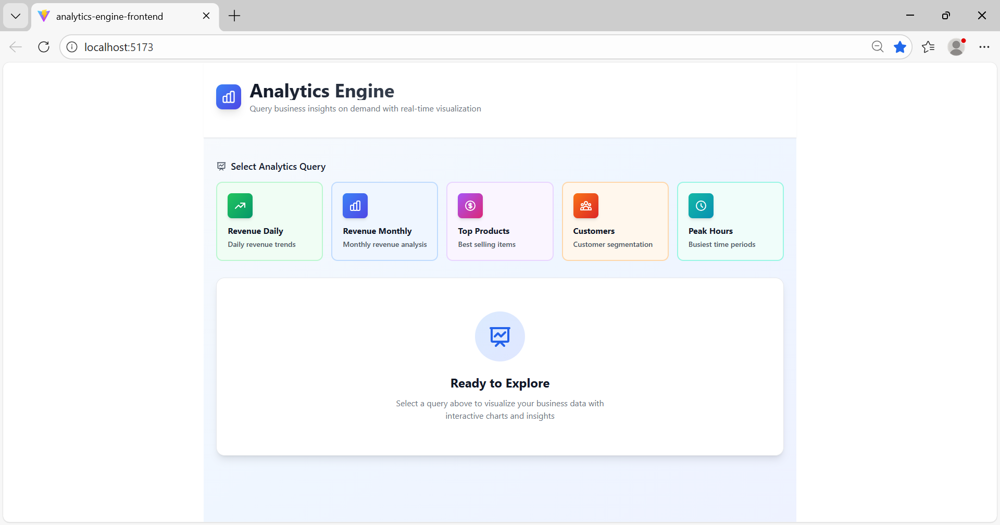
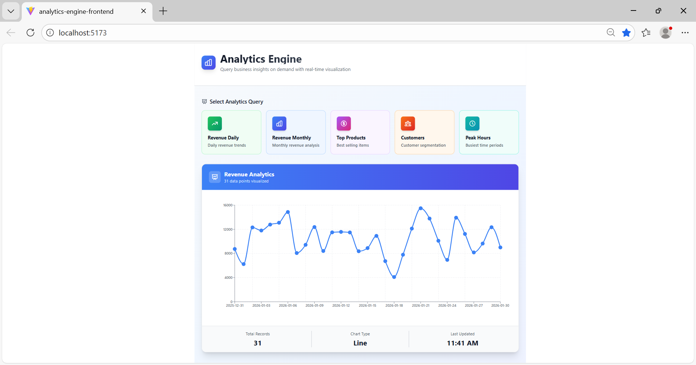
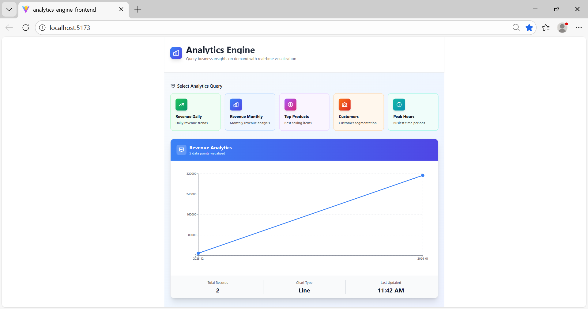
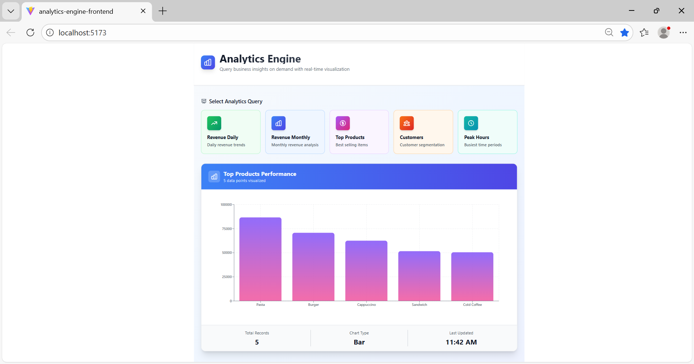
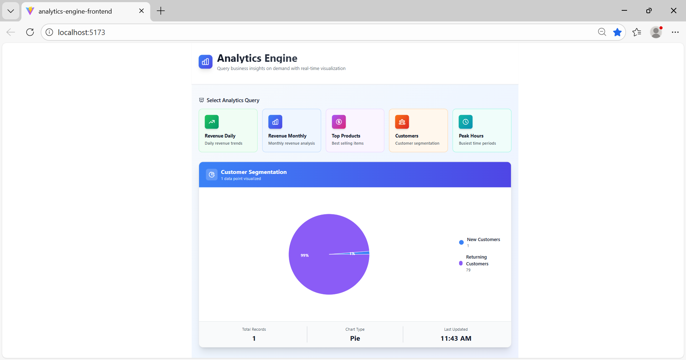
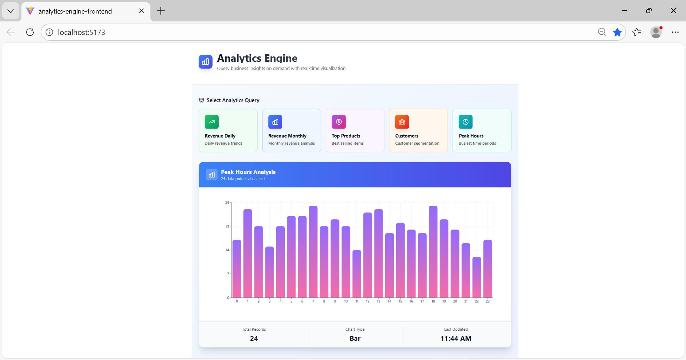

# Analytics Engine Starter

> A hands-on MongoDB Aggregation Pipeline learning project that transforms transaction data into business insights.

[](https://www.mongodb.com/)
[](https://nodejs.org/)
[](https://reactjs.org/)
[](LICENSE)

## What is this?

This is a **learning project** focused on mastering **MongoDB Aggregation Pipelines**. Instead of building a full product, I created a small analytics engine to deeply understand how to transform raw data into meaningful insights using MongoDB's powerful aggregation framework.

Think of it as a **hands-on lab** for learning aggregation concepts.

## What You'll See

This project takes simple transaction data like:
```json
{
  "customerId": "U42",
  "city": "Mumbai",
  "items": [
    { "name": "Cold Coffee", "category": "Beverages", "price": 120, "qty": 2 },
    { "name": "Sandwich", "category": "Snacks", "price": 140, "qty": 1 }
  ],
  "paymentMethod": "UPI",
  "createdAt": "2024-01-15T10:30:00Z"
}
```

And transforms it into analytics like:
- Daily and monthly revenue trends
- Top-selling products
- Customer segmentation (new vs returning)
- Peak activity hours

**All calculations happen inside MongoDB** using aggregation pipelines—not in JavaScript loops.

## Why This Matters

In real-world applications, you often need to:
- Generate reports from large datasets
- Calculate metrics without loading all data into memory
- Perform complex data transformations efficiently

MongoDB's aggregation pipeline is the tool for this, and this project demonstrates how to use it effectively.

## Tech Stack

- **Backend:** Node.js + Express.js
- **Database:** MongoDB with Mongoose
- **Frontend:** React + Recharts (for visualization)
- **Styling:** Tailwind CSS

## Quick Start

**1. Clone the repository**
```bash
git clone https://github.com/NainaKothari-14/analytics-engine-starter.git
cd analytics-engine-starter
```

**2. Install backend dependencies**
```bash
cd analytics-engine-backend
npm install
```

**3. Set up MongoDB**

Make sure MongoDB is running locally, then create a `.env` file in the `analytics-engine-backend` folder:
```env
MONGO_URI=mongodb://localhost:27017/analytics_engine
PORT=5000
```

**4. Seed sample data**
```bash
node src/utils/seed.js
```
This creates 500 sample cafe transactions across 4 Indian cities (Mumbai, Delhi, Bangalore, Pune) with products like Cold Coffee, Cappuccino, Sandwiches, and more.

**5. Start the backend server**
```bash
npm run dev
```

**6. Start the frontend** (in a new terminal, from project root)
```bash
cd analytics-engine-frontend
npm install
npm run dev
```

Open `http://localhost:5173` to see the dashboard!

## Screenshots

### Dashboard Overview


### Daily Revenue Chart


### Monthly Revenue Trends


### Top Selling Products


### Customer Segmentation


### Peak Activity Hours


## How Aggregation Works (Example)

Let's say we want to calculate **daily revenue**. Here's how the aggregation pipeline works:

**Step 1: Unwind items array**
```javascript
{ $unwind: '$items' }
```
Each transaction with multiple items becomes separate documents.

**Step 2: Group by date and sum revenue**
```javascript
{
  $group: {
    _id: { $dateToString: { format: '%Y-%m-%d', date: '$createdAt' } },
    totalRevenue: { $sum: { $multiply: ['$items.price', '$items.qty'] } }
  }
}
```
This groups transactions by day and calculates total revenue.

**Step 3: Sort chronologically**
```javascript
{ $sort: { _id: 1 } }
```

**Result:**
```json
[
  { "_id": "2024-01-15", "totalRevenue": 15000 },
  { "_id": "2024-01-16", "totalRevenue": 22000 },
  { "_id": "2024-01-17", "totalRevenue": 18500 }
]
```

This is chart-ready data—no extra processing needed!

## Key Aggregation Concepts Used

| Concept | What It Does | Used For |
|---------|-------------|----------|
| `$match` | Filter documents | Getting specific date ranges |
| `$unwind` | Flatten arrays | Breaking down item arrays |
| `$group` | Group and calculate | Summing revenue, counting customers |
| `$dateToString` | Format dates | Creating time-based groups |
| `$cond` | Conditional logic | Segmenting customers |
| `$facet` | Multiple pipelines | Running several analyses at once |
| `$sort` | Sort results | Ordering by revenue, date, etc. |
| `$limit` | Limit results | Getting top N products |

## API Endpoints

The analytics engine uses a **query-driven API** where you specify the analytics type in the request payload:

```bash
POST /api/analytics/query
```

**Request Body Examples:**

```javascript
// Daily revenue
{
  "queryType": "dailyRevenue",
  "params": { "days": 30 }
}

// Monthly revenue
{
  "queryType": "monthlyRevenue"
}

// Top selling products
{
  "queryType": "topProducts",
  "params": { "limit": 10 }
}

// Customer segmentation
{
  "queryType": "customerSegmentation"
}

// Peak activity hours
{
  "queryType": "peakHours"
}
```

This unified endpoint approach makes it easier to add new analytics types without creating new routes.

## What I Learned

Through this project, I gained hands-on experience with:

**Aggregation Pipeline Design** - How to structure pipelines for different analytics needs  
**Data Transformation** - Converting raw transactions into insights  
**Performance** - Why aggregation is faster than JavaScript loops  
**Schema Design** - How schema structure affects aggregation efficiency  
**Chart-Ready Data** - Formatting data for frontend visualization  

## Why Keep It Small?

This project is **intentionally focused** on aggregation learning rather than building a complete product. Benefits of this approach:

- Easier to understand the aggregation logic
- Clear examples without complex business logic
- Perfect for explaining concepts in interviews
- Foundation for larger analytics projects

## Next Steps

To expand this project, you could:

- [ ] Add more complex aggregations (moving averages, forecasting)
- [ ] Implement real-time analytics with Change Streams
- [ ] Add data export (CSV, PDF reports)
- [ ] Create aggregation performance benchmarks
- [ ] Add user authentication and multi-tenancy
- [ ] Build a query builder UI for custom reports

## Contributing

This is a learning project, but suggestions and improvements are welcome! Feel free to:

1. Fork the repository
2. Create a feature branch (`git checkout -b feature/improvement`)
3. Commit your changes (`git commit -m 'Add improvement'`)
4. Push to the branch (`git push origin feature/improvement`)
5. Open a Pull Request

## License

This project is licensed under the MIT License - see the [LICENSE](LICENSE) file for details.

## Author

**Naina Kothari**  
GitHub: [@NainaKothari-14](https://github.com/NainaKothari-14)

---

**Built to learn MongoDB Aggregation Pipelines**

*If this helped you understand aggregations better, consider giving it a star ⭐*
